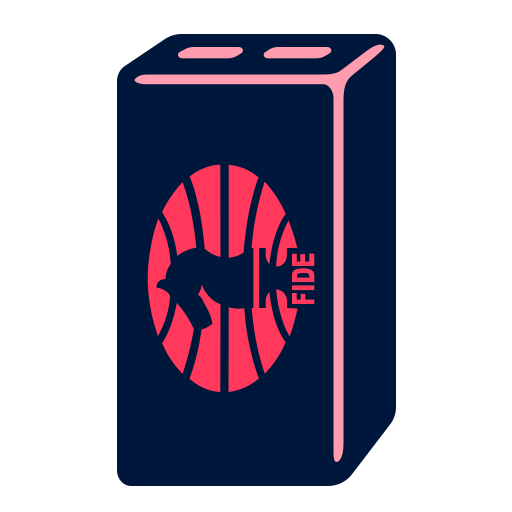
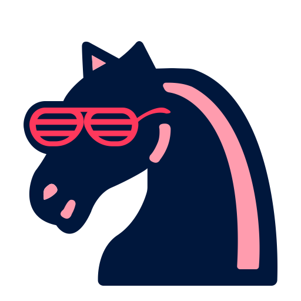
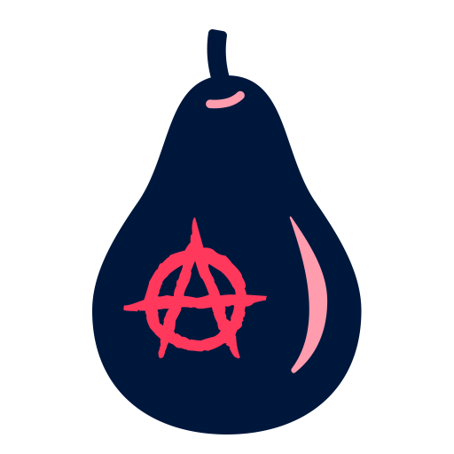
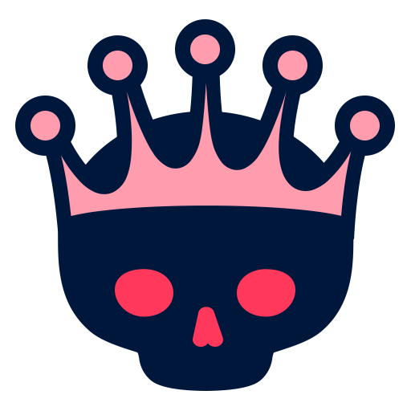
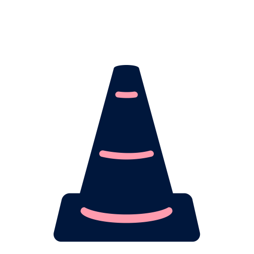
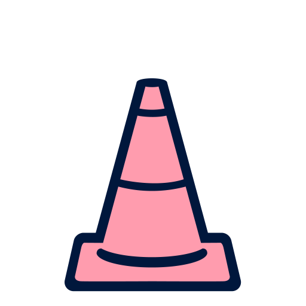
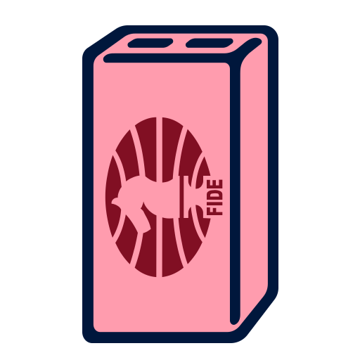
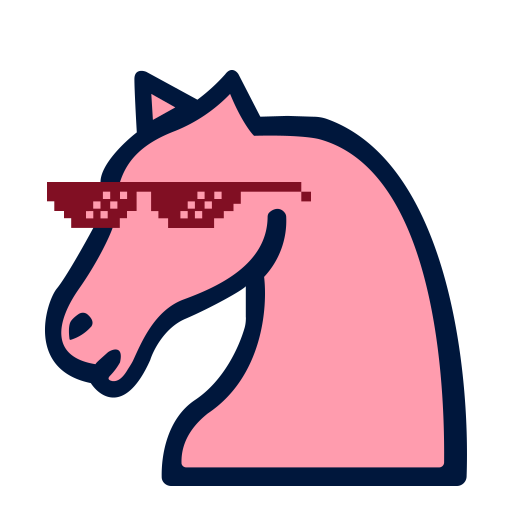
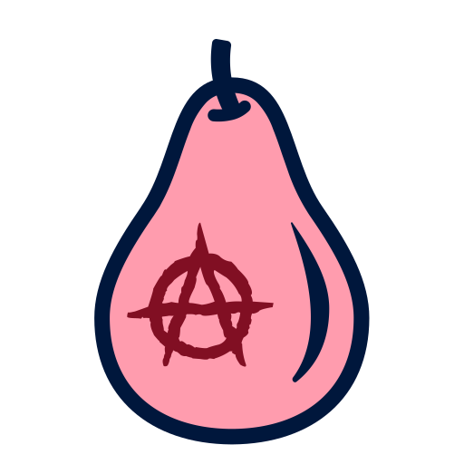
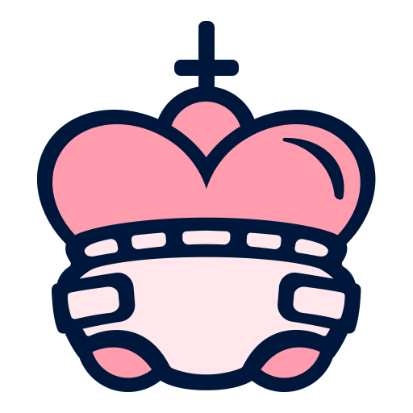

<h4 align="center">

```diff

  _   _      _ _         _   _                     ___                            __       _                 _ 
 | | | | ___| | | ___   | |_| |__   ___ _ __ ___  |_ _|   __ _ _ __ ___     __ _ / _| __ _| | ___ ___  _ __ (_)
 | |_| |/ _ \ | |/ _ \  | __| '_ \ / _ \ '__/ _ \  | |   / _` | '_ ` _ \   / _` | |_ / _` | |/ __/ _ \| '_ \| |
 |  _  |  __/ | | (_) | | |_| | | |  __/ | |  __/  | |  | (_| | | | | | | | (_| |  _| (_| | | (_| (_) | | | | |
 |_| |_|\___|_|_|\___/   \__|_| |_|\___|_|  \___| |___|  \__,_|_| |_| |_|  \__,_|_|  \__,_|_|\___\___/|_| |_|_|
                                                                                                               

```
</h4>

<h1>
	 
	Connect with me:
</h1>
<p align="center">
  <a href="" >
    
  </a> &nbsp;&nbsp;
  
  <a href="" target="_blank">
    
  </a> &nbsp;&nbsp;
  
  <a href="" target="_blank">
    
  </a> &nbsp;&nbsp;
  
  <a href="" target="_blank">
    
  </a> &nbsp;&nbsp;
<p> 


<h1>
	
	Languages and Tools
</h1>

<a href="https://skillicons.dev">
	
<a/>


<p>
	
	
	
</p>

<h1>
	Chess
</h1>

<p>
	

⚠**Game is in progress.** ⚠ there you can play chess whith me.


<!-- BEGIN CHESS BOARD -->
|   | A | B | C | D | E | F | G | H |   |
|---|:-:|:-:|:-:|:-:|:-:|:-:|:-:|:-:|:-:|
| **8** |  |  |  |  |  |  |  |  | **8** |
| **7** |  |  |  |  |  |  |  |  | **7** |
| **6** |  |  |  |  |  |  |  |  | **6** |
| **5** |  |  |  |  |  |  |  |  | **5** |
| **4** |  |  |  |  |  |  |  |  | **4** |
| **3** |  |  |  |  |  |  |  |  | **3** |
| **2** |  |  |  |  |  |  |  |  | **2** |
| **1** |  |  |  |  |  |  |  | | **1** |
|   | **A** | **B** | **C** | **D** | **E** | **F** | **G** | **H** |   |
<!-- END CHESS BOARD -->


</p>
